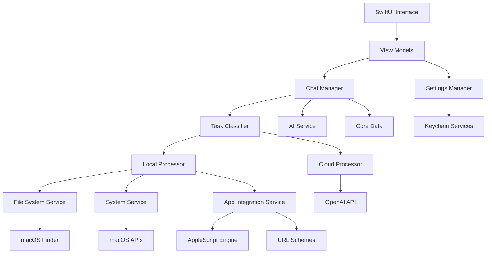

# Design Document - Sam macOS AI Assistant

## Overview

Sam is a native macOS AI assistant built with SwiftUI that combines natural language processing with task execution capabilities. The application follows a hybrid local/cloud processing architecture to balance performance, privacy, and functionality. The design emphasizes native macOS integration, user privacy, and extensible task execution while maintaining a clean, intuitive user interface.

The system is architected using MVVM pattern with SwiftUI, Core Data for persistence, and a modular task processing engine that can handle everything from simple file operations to complex multi-step workflows.

## Architecture

### High-Level Architecture



### Core Components

#### 1. Presentation Layer (SwiftUI)
- **ContentView**: Main application container with navigation
- **ChatView**: Primary chat interface with message history
- **SettingsView**: Configuration panel with tabbed interface
- **MessageBubble**: Individual message components with task results
- **TaskResultView**: Specialized views for displaying command execution results

#### 2. Business Logic Layer (MVVM)
- **ChatManager**: Orchestrates conversation flow and task execution
- **TaskProcessor**: Central coordinator for task classification and routing
- **SettingsManager**: Manages user preferences and configuration
- **WorkflowManager**: Handles multi-step task automation

#### 3. Service Layer
- **AIService**: OpenAI API integration with streaming and function calling
- **TaskClassifier**: Natural language processing for intent recognition
- **FileSystemService**: File operations and management
- **SystemService**: macOS system information and control
- **AppIntegrationService**: Third-party application automation

#### 4. Data Layer
- **Core Data Stack**: Persistent storage for chat history and settings
- **Keychain Services**: Secure storage for API keys and sensitive data
- **Local Cache**: Performance optimization for repeated queries

## Components and Interfaces

### 1. Chat Interface Component

```swift
// ChatView Architecture
struct ChatView: View {
    @StateObject private var chatManager = ChatManager()
    @State private var inputText = ""
    @State private var isProcessing = false
    
    var body: some View {
        VStack(spacing: 0) {
            // Message History
            ScrollViewReader { proxy in
                ScrollView {
                    LazyVStack(alignment: .leading, spacing: 12) {
                        ForEach(chatManager.messages) { message in
                            MessageBubbleView(message: message)
                                .id(message.id)
                        }
                    }
                    .padding()
                }
            }
            
            // Input Area
            ChatInputView(
                text: $inputText,
                isProcessing: $isProcessing,
                onSend: { chatManager.sendMessage($0) }
            )
        }
        .navigationTitle("Sam")
        .toolbar {
            ToolbarItem(placement: .primaryAction) {
                Button("Settings") {
                    // Open settings
                }
            }
        }
    }
}
```

**Key Features:**
- Real-time message streaming
- Syntax highlighting for code responses
- Task execution progress indicators
- Message history with search capability
- Keyboard shortcuts for power users

### 2. Task Classification Engine

```swift
// Task Classification System
class TaskClassifier: ObservableObject {
    enum TaskType: String, CaseIterable {
        case fileOperation = "file_operation"
        case systemQuery = "system_query"
        case appControl = "app_control"
        case textProcessing = "text_processing"
        case calculation = "calculation"
        case webQuery = "web_query"
        case automation = "automation"
        case settings = "settings"
        case help = "help"
    }
    
    struct ClassificationResult {
        let taskType: TaskType
        let confidence: Double
        let parameters: [String: Any]
        let requiresCloudProcessing: Bool
        let estimatedComplexity: TaskComplexity
    }
    
    private let localNLP = LocalNLPService()
    private let aiService = AIService()
    
    func classify(_ input: String) async -> ClassificationResult {
        // 1. Try local classification first
        if let localResult = await localNLP.quickClassify(input) {
            return localResult
        }
        
        // 2. Use AI for complex classification
        return await aiService.classifyWithContext(input)
    }
}
```

**Classification Strategy:**
- **Local Processing**: Keyword matching, regex patterns, simple intent recognition
- **Cloud Processing**: Complex natural language understanding, context-aware classification
- **Confidence Scoring**: Determines routing between local and cloud processing
- **Parameter Extraction**: Identifies file paths, app names, quantities, dates

### 3. File System Integration

```swift
// File System Service Architecture
class FileSystemService: ObservableObject {
    enum FileOperation {
        case copy(source: URL, destination: URL)
        case move(source: URL, destination: URL)
        case delete(files: [URL], moveToTrash: Bool)
        case rename(file: URL, newName: String)
        case organize(directory: URL, strategy: OrganizationStrategy)
        case search(criteria: SearchCriteria)
    }
    
    struct OperationResult {
        let success: Bool
        let processedFiles: [URL]
        let errors: [FileOperationError]
        let summary: String
        let undoAction: (() -> Void)?
    }
    
    func executeOperation(_ operation: FileOperation) async throws -> OperationResult {
        // Pre-flight checks
        try await validateOperation(operation)
        
        // Execute with progress tracking
        return try await performOperation(operation)
    }
    
    private func validateOperation(_ operation: FileOperation) async throws {
        // Permission checks
        // File existence validation
        // Disk space verification
        // User confirmation for destructive operations
    }
}
```

**File Operation Features:**
- **Batch Processing**: Handle multiple files efficiently
- **Progress Tracking**: Real-time progress for long operations
- **Undo Support**: Reversible operations where possible
- **Smart Organization**: Auto-categorization by file type, date, project
- **Metadata Extraction**: EXIF data, document properties, media information

### 4. Application Integration Framework

```swift
// App Integration Architecture
protocol AppIntegration {
    var bundleIdentifier: String { get }
    var displayName: String { get }
    var supportedCommands: [CommandDefinition] { get }
    var integrationMethods: [IntegrationMethod] { get }
    
    func canHandle(_ command: ParsedCommand) -> Bool
    func execute(_ command: ParsedCommand) async throws -> CommandResult
}

class AppIntegrationManager: ObservableObject {
    private var integrations: [String: AppIntegration] = [:]
    private let appleScriptEngine = AppleScriptEngine()
    private let urlSchemeHandler = URLSchemeHandler()
    private let accessibilityController = AccessibilityController()
    
    enum IntegrationMethod {
        case urlScheme(String)
        case appleScript
        case accessibility
        case nativeSDK
    }
    
    func registerIntegration(_ integration: AppIntegration) {
        integrations[integration.bundleIdentifier] = integration
    }
    
    func executeCommand(_ command: String, targetApp: String?) async throws -> CommandResult {
        let parsedCommand = try parseCommand(command)
        
        if let targetApp = targetApp,
           let integration = integrations[targetApp] {
            return try await integration.execute(parsedCommand)
        }
        
        // Auto-detect target app
        return try await findAndExecute(parsedCommand)
    }
}
```

**Integration Methods (Priority Order):**
1. **Native SDK**: Direct API integration where available
2. **URL Schemes**: x-callback-url and custom schemes
3. **AppleScript**: Dynamic script generation for complex operations
4. **Accessibility API**: Universal fallback for any app
5. **GUI Automation**: Last resort for unsupported apps

### 5. AI Service Integration

```swift
// AI Service with Advanced Features
class AIService: ObservableObject {
    enum Model: String, CaseIterable {
        case gpt4 = "gpt-4"
        case gpt4Turbo = "gpt-4-turbo-preview"
        case gpt35Turbo = "gpt-3.5-turbo"
        
        var costPerToken: Double {
            switch self {
            case .gpt4: return 0.00003
            case .gpt4Turbo: return 0.00001
            case .gpt35Turbo: return 0.0000015
            }
        }
    }
    
    @Published var currentUsage = UsageMetrics()
    @Published var isStreaming = false
    
    private let client = OpenAIClient()
    private let costTracker = CostTracker()
    private let contextManager = ContextManager()
    
    func streamCompletion(
        messages: [ChatMessage],
        model: Model = .gpt4Turbo,
        functions: [FunctionDefinition]? = nil
    ) -> AsyncThrowingStream<String, Error> {
        AsyncThrowingStream { continuation in
            Task {
                do {
                    let stream = try await client.streamCompletion(
                        messages: messages,
                        model: model.rawValue,
                        functions: functions
                    )
                    
                    for try await chunk in stream {
                        continuation.yield(chunk)
                        await costTracker.trackTokens(chunk, model: model)
                    }
                    
                    continuation.finish()
                } catch {
                    continuation.finish(throwing: error)
                }
            }
        }
    }
}
```

**AI Service Features:**
- **Smart Model Routing**: Automatic model selection based on query complexity
- **Function Calling**: Structured task execution through OpenAI functions
- **Cost Optimization**: Token counting, response caching, usage analytics
- **Context Management**: Conversation history with intelligent summarization
- **Streaming Responses**: Real-time response generation for better UX

## Data Models

### Core Data Schema

```swift
// Chat Message Entity
@objc(ChatMessage)
public class ChatMessage: NSManagedObject {
    @NSManaged public var id: UUID
    @NSManaged public var content: String
    @NSManaged public var timestamp: Date
    @NSManaged public var isUserMessage: Bool
    @NSManaged public var taskType: String?
    @NSManaged public var taskResult: String?
    @NSManaged public var executionTime: Double
    @NSManaged public var tokens: Int32
    @NSManaged public var cost: Double
}

// User Preferences Entity
@objc(UserPreferences)
public class UserPreferences: NSManagedObject {
    @NSManaged public var id: UUID
    @NSManaged public var preferredModel: String
    @NSManaged public var maxTokens: Int32
    @NSManaged public var temperature: Float
    @NSManaged public var autoExecuteTasks: Bool
    @NSManaged public var confirmDangerous: Bool
    @NSManaged public var themeMode: String
    @NSManaged public var shortcuts: Set<TaskShortcut>
}

// Task Shortcut Entity
@objc(TaskShortcut)
public class TaskShortcut: NSManagedObject {
    @NSManaged public var id: UUID
    @NSManaged public var name: String
    @NSManaged public var command: String
    @NSManaged public var keyboardShortcut: String?
    @NSManaged public var category: String
    @NSManaged public var createdAt: Date
    @NSManaged public var usageCount: Int32
    @NSManaged public var preferences: UserPreferences?
}

// Workflow Entity
@objc(Workflow)
public class Workflow: NSManagedObject {
    @NSManaged public var id: UUID
    @NSManaged public var name: String
    @NSManaged public var description: String
    @NSManaged public var stepsData: Data // JSON encoded WorkflowStep array
    @NSManaged public var createdAt: Date
    @NSManaged public var lastExecuted: Date?
    @NSManaged public var executionCount: Int32
    @NSManaged public var isEnabled: Bool
}
```

### Swift Data Structures

```swift
// Task Processing Models
struct ParsedCommand {
    let originalText: String
    let intent: TaskType
    let parameters: [String: Any]
    let confidence: Double
    let requiresConfirmation: Bool
}

struct TaskResult {
    let success: Bool
    let output: String
    let executionTime: TimeInterval
    let affectedFiles: [URL]?
    let undoAction: (() -> Void)?
    let followUpSuggestions: [String]
}

// Workflow Models
struct WorkflowStep {
    let id: UUID
    let type: StepType
    let parameters: [String: Any]
    let continueOnError: Bool
    let retryCount: Int
    
    enum StepType {
        case fileOperation
        case systemCommand
        case appIntegration
        case userInput
        case conditional
        case delay(TimeInterval)
    }
}

// System Information Models
struct SystemInfo {
    let batteryLevel: Double?
    let batteryIsCharging: Bool
    let availableStorage: Int64
    let memoryUsage: MemoryInfo
    let networkStatus: NetworkStatus
    let runningApps: [AppInfo]
}
```

## Error Handling

### Error Hierarchy

```swift
// Comprehensive Error Handling
enum SamError: LocalizedError {
    case taskClassification(TaskClassificationError)
    case fileOperation(FileOperationError)
    case systemAccess(SystemAccessError)
    case appIntegration(AppIntegrationError)
    case aiService(AIServiceError)
    case workflow(WorkflowError)
    
    var errorDescription: String? {
        switch self {
        case .taskClassification(let error):
            return "Task classification failed: \(error.localizedDescription)"
        case .fileOperation(let error):
            return "File operation failed: \(error.localizedDescription)"
        case .systemAccess(let error):
            return "System access denied: \(error.localizedDescription)"
        case .appIntegration(let error):
            return "App integration failed: \(error.localizedDescription)"
        case .aiService(let error):
            return "AI service error: \(error.localizedDescription)"
        case .workflow(let error):
            return "Workflow execution failed: \(error.localizedDescription)"
        }
    }
    
    var recoverySuggestion: String? {
        switch self {
        case .systemAccess:
            return "Please grant necessary permissions in System Preferences > Security & Privacy"
        case .aiService(.rateLimitExceeded):
            return "API rate limit exceeded. Please wait a moment and try again."
        case .fileOperation(.insufficientPermissions):
            return "Sam needs permission to access this location. Please check file permissions."
        default:
            return "Please try again or contact support if the problem persists."
        }
    }
}
```

### Error Recovery Strategies

1. **Graceful Degradation**: Fall back to simpler methods when advanced features fail
2. **User Guidance**: Provide clear instructions for resolving permission issues
3. **Retry Logic**: Automatic retry with exponential backoff for transient failures
4. **Alternative Approaches**: Suggest different ways to accomplish the same task
5. **Detailed Logging**: Comprehensive error tracking for debugging and improvement

## Testing Strategy

### Unit Testing Framework

```swift
// Example Test Structure
import XCTest
@testable import Sam

class TaskClassifierTests: XCTestCase {
    var classifier: TaskClassifier!
    var mockAIService: MockAIService!
    
    override func setUp() {
        super.setUp()
        mockAIService = MockAIService()
        classifier = TaskClassifier(aiService: mockAIService)
    }
    
    func testFileOperationClassification() async {
        // Given
        let input = "copy report.pdf from Downloads to Desktop"
        
        // When
        let result = await classifier.classify(input)
        
        // Then
        XCTAssertEqual(result.taskType, .fileOperation)
        XCTAssertGreaterThan(result.confidence, 0.8)
        XCTAssertEqual(result.parameters["source"] as? String, "Downloads/report.pdf")
        XCTAssertEqual(result.parameters["destination"] as? String, "Desktop")
    }
    
    func testSystemQueryClassification() async {
        // Given
        let input = "what's my battery percentage?"
        
        // When
        let result = await classifier.classify(input)
        
        // Then
        XCTAssertEqual(result.taskType, .systemQuery)
        XCTAssertEqual(result.parameters["queryType"] as? String, "battery")
    }
}

class FileSystemServiceTests: XCTestCase {
    var fileService: FileSystemService!
    var tempDirectory: URL!
    
    override func setUp() {
        super.setUp()
        fileService = FileSystemService()
        tempDirectory = FileManager.default.temporaryDirectory
            .appendingPathComponent(UUID().uuidString)
        try! FileManager.default.createDirectory(at: tempDirectory, withIntermediateDirectories: true)
    }
    
    override func tearDown() {
        try? FileManager.default.removeItem(at: tempDirectory)
        super.tearDown()
    }
    
    func testFileCopyOperation() async throws {
        // Given
        let sourceFile = tempDirectory.appendingPathComponent("test.txt")
        let destinationFile = tempDirectory.appendingPathComponent("copy.txt")
        try "Test content".write(to: sourceFile, atomically: true, encoding: .utf8)
        
        // When
        let result = try await fileService.executeOperation(
            .copy(source: sourceFile, destination: destinationFile)
        )
        
        // Then
        XCTAssertTrue(result.success)
        XCTAssertTrue(FileManager.default.fileExists(atPath: destinationFile.path))
        XCTAssertEqual(result.processedFiles.count, 1)
    }
}
```

### Integration Testing

```swift
// Integration Test Examples
class AppIntegrationTests: XCTestCase {
    func testSafariURLOpening() async throws {
        let integration = SafariIntegration()
        let command = ParsedCommand(
            originalText: "open github.com",
            intent: .appControl,
            parameters: ["url": "https://github.com"],
            confidence: 0.95,
            requiresConfirmation: false
        )
        
        let result = try await integration.execute(command)
        XCTAssertTrue(result.success)
    }
    
    func testMailComposition() async throws {
        let integration = MailIntegration()
        let command = ParsedCommand(
            originalText: "send email to john@example.com about project update",
            intent: .appControl,
            parameters: [
                "to": ["john@example.com"],
                "subject": "project update"
            ],
            confidence: 0.9,
            requiresConfirmation: true
        )
        
        let result = try await integration.execute(command)
        XCTAssertTrue(result.success)
    }
}
```

### Performance Testing

```swift
// Performance Test Framework
class PerformanceTests: XCTestCase {
    func testTaskClassificationPerformance() {
        let classifier = TaskClassifier()
        let testInputs = [
            "copy file.txt to Desktop",
            "what's my battery level",
            "open Safari and go to apple.com",
            "summarize this document"
        ]
        
        measure {
            for input in testInputs {
                _ = classifier.classifyLocally(input)
            }
        }
    }
    
    func testFileOperationPerformance() async {
        let fileService = FileSystemService()
        let tempDir = FileManager.default.temporaryDirectory
        
        // Create 100 test files
        let testFiles = (1...100).map { tempDir.appendingPathComponent("test\($0).txt") }
        for file in testFiles {
            try! "Test content".write(to: file, atomically: true, encoding: .utf8)
        }
        
        await measureAsync {
            _ = try! await fileService.executeOperation(
                .organize(directory: tempDir, strategy: .byType)
            )
        }
    }
}
```

### UI Testing

```swift
// SwiftUI UI Tests
class SamUITests: XCTestCase {
    var app: XCUIApplication!
    
    override func setUp() {
        super.setUp()
        app = XCUIApplication()
        app.launch()
    }
    
    func testChatInterface() {
        // Test basic chat functionality
        let chatInput = app.textFields["Ask Sam anything..."]
        XCTAssertTrue(chatInput.exists)
        
        chatInput.tap()
        chatInput.typeText("what's my battery level?")
        app.buttons["Send"].tap()
        
        // Verify response appears
        let responseText = app.staticTexts.containing(NSPredicate(format: "label CONTAINS 'Battery'"))
        XCTAssertTrue(responseText.element.waitForExistence(timeout: 5))
    }
    
    func testSettingsPanel() {
        app.buttons["Settings"].tap()
        
        let settingsWindow = app.windows["Settings"]
        XCTAssertTrue(settingsWindow.exists)
        
        // Test API key input
        let apiKeyField = settingsWindow.secureTextFields["OpenAI API Key"]
        XCTAssertTrue(apiKeyField.exists)
    }
}
```

## Security Considerations

### Data Protection

1. **API Key Security**: Store OpenAI API keys in macOS Keychain with proper access controls
2. **Local Data Encryption**: Encrypt sensitive chat history and user preferences
3. **Network Security**: Use TLS 1.3 for all external communications
4. **Sandboxing**: Respect macOS app sandboxing while requesting minimal necessary permissions

### Privacy Implementation

```swift
// Privacy-First Data Handling
class PrivacyManager {
    enum DataSensitivity {
        case public
        case personal
        case sensitive
        case confidential
    }
    
    func classifyDataSensitivity(_ content: String) -> DataSensitivity {
        // Analyze content for PII, financial data, etc.
        if containsPersonalInfo(content) {
            return .personal
        }
        if containsFinancialData(content) {
            return .confidential
        }
        return .public
    }
    
    func shouldProcessLocally(_ content: String) -> Bool {
        let sensitivity = classifyDataSensitivity(content)
        return sensitivity != .public
    }
}
```

### Permission Management

```swift
// Comprehensive Permission Handling
class PermissionManager: ObservableObject {
    @Published var fileSystemAccess = false
    @Published var accessibilityAccess = false
    @Published var automationAccess = false
    
    func requestFileSystemAccess() async -> Bool {
        // Request file system access through macOS APIs
        return await requestPermission(.fileSystem)
    }
    
    func requestAccessibilityAccess() async -> Bool {
        // Guide user to System Preferences for accessibility
        return await requestPermission(.accessibility)
    }
    
    private func requestPermission(_ type: PermissionType) async -> Bool {
        // Implementation for each permission type
        // Provide clear explanations and guidance
    }
}
```

This design provides a comprehensive foundation for building Sam as a native macOS AI assistant that balances functionality, performance, privacy, and user experience. The modular architecture allows for incremental development and easy extension of capabilities while maintaining code quality and testability.