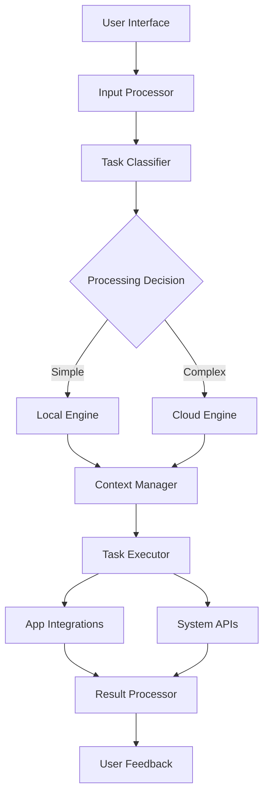

# Product Requirements Document (PRD)
## macOS AI Assistant - "Computerbeing" Platform

### Document Information
- **Product Name**: MacOS AI Assistant (Working Title: "Sam")
- **Version**: 1.0
- **Last Updated**: August 2025
- **Document Owner**: Product Team
- **Status**: Draft for Development

---

## 1. Executive Summary

### 1.1 Product Vision
Build a revolutionary AI assistant for macOS that performs tasks rather than just providing instructions, creating a new paradigm for human-computer interaction through natural language commands and deep system integration.

### 1.2 Product Mission
Eliminate the friction between user intent and task completion on macOS by providing an intelligent, privacy-first AI companion that understands context, learns user preferences, and executes complex workflows seamlessly.

### 1.3 Success Metrics
- **User Adoption**: 10K+ active beta users within 6 months
- **Task Completion Rate**: >85% successful task execution
- **User Satisfaction**: >4.5/5.0 rating
- **Privacy Trust**: 0 major privacy incidents
- **Developer Adoption**: 50+ integrated applications

---

## 2. Product Overview

### 2.1 Product Description
A native macOS application that serves as an intelligent AI assistant capable of:
- Understanding natural language requests
- Performing actual tasks rather than providing instructions
- Learning user preferences and workflows
- Maintaining privacy through local processing
- Integrating with macOS applications and system functions

### 2.2 Core Value Propositions
1. **Task Execution**: Actually performs tasks vs. instruction-giving
2. **Privacy-First**: Local processing with minimal cloud dependencies
3. **Native Integration**: Deep macOS system and app integration
4. **Contextual Intelligence**: Learns and adapts to user workflows
5. **Universal Interface**: Single point of interaction for multiple apps

### 2.3 Target Users

#### Primary Users
- **Mac Power Users**: Professionals who use multiple applications daily
- **Content Creators**: Video editors, designers, writers
- **Developers**: Software engineers working on macOS
- **Knowledge Workers**: Researchers, analysts, consultants

#### Secondary Users
- **Students**: Academic research and productivity
- **Small Business Owners**: Task automation and efficiency
- **Mac Enthusiasts**: Early adopters of Apple ecosystem tools

---

## 3. Market Analysis

### 3.1 Market Size
- **Total Addressable Market**: 100M+ Mac users globally
- **Serviceable Available Market**: 25M productivity-focused Mac users
- **Serviceable Obtainable Market**: 2.5M early adopters in first 2 years

### 3.2 Competitive Landscape

#### Direct Competitors
- **Siri**: Limited capabilities, privacy concerns
- **ChatGPT Desktop**: Instruction-focused, no task execution
- **Microsoft Copilot**: Windows-focused, less Mac integration

#### Indirect Competitors
- **Raycast**: Launcher with AI features
- **Alfred**: Productivity launcher
- **Shortcut apps**: Task automation tools

### 3.3 Competitive Advantages
1. Native macOS optimization
2. Actual task execution capability
3. Privacy-first architecture
4. Deep system integration
5. Extensible plugin ecosystem

---

## 4. Technical Requirements

### 4.1 System Architecture

#### 4.1.1 Core Components

**A. Task Classification Engine**
```
User Input → NLP Processing → Task Classification → {
    Local Processing: Simple tasks (file ops, text, calendar)
    Cloud Processing: Complex tasks (multi-step, reasoning, APIs)
}
```

**B. Local Processing Engine**
- **Base Model**: Fine-tuned Llama 3.2 3B or similar
- **Framework**: CoreML for on-device inference
- **Capabilities**: File operations, text processing, system queries
- **Performance Target**: <2 second response time

**C. Context Management System ("Mnemos")**
- **File System Indexing**: Real-time file metadata and content
- **Application State**: Currently running apps and their states
- **User Preferences**: Learned behaviors and patterns
- **Historical Context**: Previous interactions and outcomes

**D. Cloud Processing Backend**
- **Infrastructure**: AWS/Google Cloud with edge locations
- **Models**: GPT-4/Claude for complex reasoning
- **Security**: End-to-end encryption, no data retention
- **Failover**: Graceful degradation to local processing

#### 4.1.2 Technology Stack

**Frontend (macOS App)**
- **Language**: Swift + SwiftUI
- **Architecture**: MVVM with Combine
- **UI Framework**: Native macOS design system
- **Performance**: 60fps UI, <100MB memory usage

**Local AI Engine**
- **ML Framework**: CoreML + CreateML
- **Models**: Quantized models for efficiency
- **Storage**: Core Data for context management
- **APIs**: macOS system APIs (Accessibility, AppleScript, etc.)

**Backend Services**
- **API**: RESTful APIs with GraphQL for complex queries
- **Database**: PostgreSQL for skill definitions, MongoDB for logs
- **Caching**: Redis for session management
- **Monitoring**: Comprehensive logging and analytics

**Integration Layer**
- **SDK**: Native macOS framework for third-party apps
- **Protocols**: URL schemes, Apple Events, Accessibility APIs
- **Security**: App sandboxing, permission management

### 4.2 Performance Requirements
- **Response Time**: <2s for local tasks, <5s for cloud tasks
- **Memory Usage**: <200MB baseline, <500MB peak
- **CPU Usage**: <10% during idle, <50% during processing
- **Battery Impact**: <5% additional drain per hour of active use
- **Storage**: <1GB app size, <5GB for models and cache

### 4.3 Security & Privacy Requirements

#### Privacy Architecture
1. **Local-First Processing**: 80%+ tasks handled on-device
2. **Data Minimization**: Only necessary data sent to cloud
3. **No Training Data**: User data never used for model training
4. **Encryption**: AES-256 for local storage, TLS 1.3 for network
5. **User Control**: Granular permissions and data management

#### Security Measures
- **Code Signing**: Apple Developer Program validation
- **Sandboxing**: App Store security requirements
- **Permission Model**: Request only necessary system access
- **Audit Trail**: Comprehensive logging of data access
- **Regular Security Reviews**: Quarterly penetration testing

---

## 5. Feature Requirements

### 5.1 Core Features (MVP)

#### 5.1.1 Natural Language Interface
- **Input Methods**: Text input, voice input, keyboard shortcuts
- **Understanding**: Intent recognition, parameter extraction
- **Feedback**: Real-time processing indicators, result confirmation
- **Error Handling**: Graceful failure with alternative suggestions

#### 5.1.2 Task Execution Engine
- **File Operations**: Copy, move, rename, format conversion
- **Text Processing**: Summarization, translation, formatting
- **System Control**: Volume, brightness, network, app launching
- **Calendar Integration**: Event creation, scheduling, reminders

#### 5.1.3 Context Management
- **File Awareness**: Current directory, recent files, file types
- **App State**: Running applications, active windows, clipboard
- **User Patterns**: Frequently used operations, preferred formats
- **Session Memory**: Conversation context, related tasks

#### 5.1.4 Application Integration
- **Native Apps**: Finder, Mail, Calendar, Notes, Safari
- **Creative Apps**: Photoshop, Figma, Sketch (via SDK)
- **Productivity Apps**: Office suite, PDF tools, text editors
- **Developer Tools**: Xcode, VS Code, Terminal integration

### 5.2 Advanced Features (Post-MVP)

#### 5.2.1 Workflow Automation
- **Multi-Step Tasks**: Chain operations across multiple apps
- **Conditional Logic**: If-then scenarios based on file types/content
- **Batch Operations**: Process multiple files/items simultaneously
- **Scheduled Tasks**: Time-based or trigger-based automation

#### 5.2.2 Learning & Personalization
- **Usage Patterns**: Learn frequently performed tasks
- **Preference Adaptation**: Adjust to user's preferred tools/formats
- **Predictive Suggestions**: Proactive task recommendations
- **Custom Shortcuts**: User-defined command aliases

#### 5.2.3 Developer Ecosystem
- **Plugin SDK**: Framework for third-party integrations
- **Skill Marketplace**: Browse and install community extensions
- **API Access**: Programmatic access for other applications
- **Webhook Support**: Integration with web services and automation

### 5.3 UI/UX Requirements

#### 5.3.1 Interface Design
- **Primary Interface**: Floating window with search-like input
- **Activation**: Keyboard shortcut (Cmd+Space alternative)
- **Visual Design**: Native macOS design language
- **Accessibility**: Full VoiceOver and keyboard navigation support

#### 5.3.2 User Experience
- **Onboarding**: Guided setup with privacy explanations
- **Feedback System**: Visual and audio feedback for task completion
- **Error Recovery**: Clear error messages with suggested fixes
- **Help System**: Contextual help and example commands

#### 5.3.3 Settings & Configuration
- **Privacy Controls**: Granular data access permissions
- **Integration Management**: Enable/disable app integrations
- **Appearance**: Light/dark mode, window positioning
- **Performance**: Local vs. cloud processing preferences

---

## 6. Integration Requirements

### 6.1 macOS System Integration

#### 6.1.1 Core System APIs
- **Accessibility API**: Control other applications
- **AppleScript/AppleEvents**: Legacy app automation
- **Shortcuts**: Integration with macOS Shortcuts app
- **Spotlight**: Enhanced search capabilities
- **Notification Center**: Task completion notifications

#### 6.1.2 File System Integration
- **File Access**: Full file system access with user permission
- **Quick Look**: Preview files without opening applications
- **Metadata**: Extract and utilize file metadata
- **Version Control**: Integration with Time Machine/Git

#### 6.1.3 Security Integration
- **Keychain**: Secure credential storage
- **Touch ID/Face ID**: Biometric authentication
- **Gatekeeper**: Code signing and security verification
- **Privacy Controls**: Respect system privacy settings

### 6.2 Third-Party Application Integration

#### 6.2.1 SDK Development
- **Framework**: Native macOS framework (Swift/Objective-C)
- **Documentation**: Comprehensive developer guides
- **Examples**: Sample integrations and use cases
- **Support**: Developer community and technical support

#### 6.2.2 Integration Types
- **URL Schemes**: Simple command passing
- **Apple Events**: Rich application control
- **Accessibility**: Universal application interaction
- **Direct API**: Native SDK integration for full control

#### 6.2.3 Partner Applications (Launch Partners)
- **Adobe Creative Cloud**: Photoshop, Illustrator, Premiere
- **Productivity**: Notion, Obsidian, Things, OmniFocus
- **Development**: Xcode, VS Code, Tower, Sourcetree
- **Media**: VLC, Plex, Music apps

### 6.3 Cloud Service Integration

#### 6.3.1 Storage Services
- **iCloud**: Native integration for file sync
- **Google Drive**: File access and manipulation
- **Dropbox**: File operations and sharing
- **OneDrive**: Microsoft ecosystem integration

#### 6.3.2 Web Services
- **Weather APIs**: Real-time weather information
- **Translation Services**: Multi-language support
- **Currency APIs**: Real-time exchange rates
- **News APIs**: Content summarization

---

## 7. Development Plan

### 7.1 Development Phases

#### Phase 1: Foundation (Months 1-3)
**Objectives**: Build core architecture and basic functionality
- **Local AI Engine**: Implement basic NLP and task classification
- **Context System**: File system indexing and basic context awareness
- **UI Foundation**: Create main interface and settings
- **Core Tasks**: File operations, text processing, system control

**Key Deliverables**:
- Working prototype with 20 basic commands
- Local AI model integration
- Basic file system integration
- Foundational UI/UX

#### Phase 2: Integration (Months 4-6)
**Objectives**: Add application integrations and cloud processing
- **App Integration**: Native macOS apps (Finder, Mail, Calendar)
- **Cloud Backend**: Implement hybrid processing architecture
- **Advanced Tasks**: Multi-step operations, workflow chains
- **Error Handling**: Robust error recovery and user feedback

**Key Deliverables**:
- 50+ supported commands
- Cloud processing pipeline
- Integration with 5 major macOS apps
- Beta-ready application

#### Phase 3: Ecosystem (Months 7-9)
**Objectives**: Build third-party ecosystem and advanced features
- **SDK Development**: Create and document integration framework
- **Partner Integrations**: Launch partner applications
- **Learning System**: Implement personalization and pattern recognition
- **Performance Optimization**: Battery and memory optimizations

**Key Deliverables**:
- Public SDK release
- 10+ third-party integrations
- Personalization features
- Performance targets met

#### Phase 4: Scale (Months 10-12)
**Objectives**: Public launch preparation and scaling
- **Security Audit**: Comprehensive security review
- **App Store Submission**: Prepare for App Store release
- **Documentation**: User guides and developer documentation
- **Support System**: Customer support and community forums

**Key Deliverables**:
- App Store approved application
- Complete documentation
- Support infrastructure
- Public launch readiness

### 7.2 Team Requirements

#### 7.2.1 Core Team (12 people)
- **Product Manager** (1): Product strategy and requirements
- **Engineering Manager** (1): Technical leadership and coordination
- **macOS Engineers** (4): Native app development, system integration
- **AI/ML Engineers** (2): Local models, NLP, context management
- **Backend Engineers** (2): Cloud infrastructure, APIs
- **UI/UX Designer** (1): Interface design, user experience
- **QA Engineer** (1): Testing, quality assurance

#### 7.2.2 Extended Team (8 people)
- **DevOps Engineer** (1): Infrastructure, deployment, monitoring
- **Security Engineer** (1): Security review, privacy compliance
- **Technical Writer** (1): Documentation, user guides
- **Developer Relations** (1): SDK, partner integrations, community
- **Data Analyst** (1): Usage analytics, performance metrics
- **Support Engineer** (1): Customer support, issue resolution
- **Legal/Compliance** (1): Privacy regulations, terms of service
- **Marketing** (1): Go-to-market strategy, user acquisition

### 7.3 Technology Decisions

#### 7.3.1 Local AI Models
**Recommended**: Fine-tuned Llama 3.2 3B
- **Rationale**: Good balance of capability and efficiency
- **Alternatives**: Phi-3 Mini, Mistral 7B (if more power needed)
- **Deployment**: CoreML optimized for Apple Silicon

#### 7.3.2 Cloud AI Services
**Recommended**: OpenAI GPT-4 + Anthropic Claude
- **Rationale**: Best reasoning capabilities for complex tasks
- **Backup**: Google Gemini Pro for redundancy
- **Cost Management**: Intelligent routing based on task complexity

#### 7.3.3 Backend Infrastructure
**Recommended**: AWS with multi-region deployment
- **Services**: ECS/Fargate, RDS, ElastiCache, CloudFront
- **Alternatives**: Google Cloud Platform for AI services
- **Monitoring**: DataDog or New Relic for comprehensive monitoring

### 7.4 Budget Estimate

#### 7.4.1 Development Costs (12 months)
- **Personnel**: $2.4M (team of 20 @ average $120k)
- **Infrastructure**: $300K (cloud services, development tools)
- **Third-Party Services**: $200K (AI APIs, monitoring, analytics)
- **Legal/Compliance**: $100K (privacy review, terms of service)
- **Marketing**: $500K (launch campaign, developer outreach)
- **Contingency (20%)**: $700K
- **Total**: $4.2M

#### 7.4.2 Ongoing Costs (Annual)
- **Personnel**: $3.0M (expanded team of 25)
- **Infrastructure**: $500K (production scaling)
- **AI Services**: $400K (usage-based pricing)
- **Support & Operations**: $300K (customer support, monitoring)
- **Marketing**: $800K (user acquisition, partnerships)
- **Total Annual**: $5.0M

---

## 8. Go-to-Market Strategy

### 8.1 Launch Strategy

#### 8.1.1 Beta Program
- **Private Beta**: 100 invited power users (Months 7-8)
- **Public Beta**: 1,000 sign-ups from website (Months 9-10)
- **Developer Beta**: 50 integration partners (Month 8-11)
- **Feedback Integration**: Continuous improvement based on beta feedback

#### 8.1.2 Launch Channels
- **App Store**: Primary distribution channel
- **Direct Distribution**: Website download for advanced users
- **Developer Relations**: Technical conferences, meetups
- **Content Marketing**: Blog posts, tutorials, case studies

#### 8.1.3 Pricing Strategy
- **Freemium**: Basic features free with local processing
- **Pro Subscription**: $9.99/month for cloud features, advanced integrations
- **Developer**: Free SDK with revenue sharing for marketplace
- **Enterprise**: Custom pricing for team features and support

### 8.2 Marketing & User Acquisition

#### 8.2.1 Target Channels
- **Product Hunt**: Launch announcement and community building
- **Tech Blogs**: TechCrunch, The Verge, 9to5Mac coverage
- **YouTube**: Demo videos, tutorials, power user testimonials
- **Twitter**: Developer community, Mac enthusiast engagement
- **Reddit**: r/MacOS, r/productivity community engagement

#### 8.2.2 Content Strategy
- **Educational**: "How AI assistants work" content series
- **Comparative**: "Why local processing matters" positioning
- **Use Cases**: Specific workflows for different user types
- **Technical**: Deep dives for developer audience

#### 8.2.3 Partnership Strategy
- **App Developers**: Integration partnerships with popular Mac apps
- **YouTubers**: Sponsorships with productivity and tech channels
- **Conferences**: Sponsorship at WWDC, developer conferences
- **Communities**: Engagement with Mac and productivity communities

---

## 9. Success Metrics & KPIs

### 9.1 User Adoption Metrics
- **Total Users**: 10K beta, 100K within year 1
- **Daily Active Users**: 60% of total users
- **Monthly Retention**: >75% after month 3
- **User Growth Rate**: 20% month-over-month during launch

### 9.2 Product Performance Metrics
- **Task Success Rate**: >85% successful task completion
- **Response Time**: <2s local, <5s cloud (95th percentile)
- **App Crashes**: <0.1% crash rate
- **User Satisfaction**: >4.5/5.0 App Store rating

### 9.3 Business Metrics
- **Conversion Rate**: 25% free to paid conversion
- **Revenue per User**: $60 annual average
- **Customer Acquisition Cost**: <$50 per user
- **Lifetime Value**: >$200 per user

### 9.4 Ecosystem Metrics
- **Partner Integrations**: 50+ integrated apps within year 1
- **SDK Downloads**: 1,000+ developer downloads
- **Community Contributions**: 100+ community-built skills
- **API Usage**: 1M+ API calls per month from integrations

### 9.5 Privacy & Security Metrics
- **Data Breaches**: Zero tolerance - 0 incidents
- **Privacy Compliance**: 100% GDPR, CCPA compliance
- **Local Processing Rate**: 80%+ tasks handled on-device
- **User Trust Score**: >4.0/5.0 on privacy surveys

---

## 10. Risk Assessment & Mitigation

### 10.1 Technical Risks

#### 10.1.1 AI Model Performance
**Risk**: Local models insufficient for complex tasks
- **Impact**: High - Core functionality compromised
- **Probability**: Medium - Model capabilities evolving rapidly
- **Mitigation**: 
  - Implement robust hybrid architecture with cloud fallback
  - Continuous model evaluation and updates
  - A/B testing of different model configurations

#### 10.1.2 macOS Integration Complexity
**Risk**: Apple system APIs change or become restricted
- **Impact**: High - Core integrations broken
- **Probability**: Medium - Apple frequently updates APIs
- **Mitigation**:
  - Close monitoring of WWDC announcements
  - Multiple integration methods for critical functions
  - Strong relationship with Apple Developer Relations

#### 10.1.3 Performance Issues
**Risk**: App consumes too much battery/memory
- **Impact**: High - User adoption suffers
- **Probability**: Medium - AI models are resource-intensive
- **Mitigation**:
  - Extensive performance testing and optimization
  - Configurable performance modes (battery vs. performance)
  - Efficient model quantization and caching

### 10.2 Business Risks

#### 10.2.1 Apple Competition
**Risk**: Apple releases similar functionality in macOS
- **Impact**: Very High - Direct competition with OS vendor
- **Probability**: High - Apple expanding AI capabilities
- **Mitigation**:
  - Focus on developer ecosystem and extensibility
  - Maintain superior user experience and features
  - Pivot to complementary services if needed

#### 10.2.2 Market Adoption
**Risk**: Users don't understand or adopt new interaction paradigm
- **Impact**: High - Business model fails
- **Probability**: Medium - New concepts require education
- **Mitigation**:
  - Extensive user education and onboarding
  - Gradual feature introduction and familiar interfaces
  - Strong focus on solving real user problems

#### 10.2.3 Privacy Concerns
**Risk**: Users don't trust AI assistant with their data
- **Impact**: High - Fundamental adoption blocker
- **Probability**: Medium - Growing privacy awareness
- **Mitigation**:
  - Transparent privacy practices and communication
  - Third-party privacy audits and certifications
  - User control over data sharing and processing

### 10.3 Regulatory Risks

#### 10.3.1 Privacy Regulations
**Risk**: New privacy laws require significant changes
- **Impact**: Medium - Development and compliance costs
- **Probability**: High - Evolving regulatory landscape
- **Mitigation**:
  - Privacy-by-design architecture from start
  - Legal review at each development phase
  - Flexible data handling systems

#### 10.3.2 AI Regulations
**Risk**: AI regulations limit functionality or require disclosure
- **Impact**: Medium - Feature restrictions or compliance overhead
- **Probability**: Medium - AI regulation still developing
- **Mitigation**:
  - Monitor regulatory developments closely
  - Implement transparent AI decision-making
  - Engage with regulatory bodies and industry groups

---

## 11. Technical Implementation Details

### 11.1 Architecture Deep Dive

#### 11.1.1 System Components



#### 11.1.2 Data Flow Architecture

**Input Processing Pipeline:**
1. **Natural Language Input** → Raw text/voice from user
2. **Intent Classification** → Determine task category and parameters
3. **Context Enrichment** → Add relevant user/system context
4. **Task Planning** → Break complex tasks into steps
5. **Execution Route** → Choose local vs. cloud processing
6. **Action Execution** → Perform actual system/app operations
7. **Result Validation** → Confirm task completion
8. **User Feedback** → Provide status and results

#### 11.1.3 Local Processing Engine

**Core Components:**
```swift
// Local AI Engine Structure
class LocalAIEngine {
    private let taskClassifier: TaskClassifier
    private let parameterExtractor: ParameterExtractor
    private let contextManager: ContextManager
    private let executionEngine: ExecutionEngine
    
    func processTask(_ input: UserInput) -> TaskResult {
        let classification = taskClassifier.classify(input)
        let parameters = parameterExtractor.extract(from: input)
        let context = contextManager.getCurrentContext()
        return executionEngine.execute(classification, parameters, context)
    }
}
```

**Model Specifications:**
- **Task Classifier**: Quantized Llama 3.2 3B → CoreML
- **Parameter Extractor**: Fine-tuned BERT → CoreML
- **Context Embeddings**: Sentence-BERT → CoreML
- **Memory Usage**: <512MB total for all models
- **Inference Time**: <1 second per query on Apple Silicon

### 11.2 Security Implementation

#### 11.2.1 Data Protection Architecture

```swift
// Security Layer Implementation
class SecurityManager {
    private let encryptionService = AES256EncryptionService()
    private let keychainManager = KeychainManager()
    private let accessController = AccessController()
    
    func secureDataAccess(_ request: DataRequest) -> SecureDataResponse {
        guard accessController.hasPermission(request.type) else {
            return .unauthorized
        }
        
        let encryptedData = encryptionService.encrypt(request.data)
        return .success(encryptedData)
    }
}
```

#### 11.2.2 Privacy Controls

**User Data Categories:**
1. **System Data**: File metadata, app states (encrypted locally)
2. **Content Data**: File contents, text snippets (user-controlled access)
3. **Usage Data**: Command patterns, preferences (anonymized analytics)
4. **Personal Data**: Calendar events, emails (explicit permission required)

**Access Control Matrix:**
| Data Type | Local Storage | Cloud Processing | Third-Party Sharing |
|-----------|---------------|------------------|-------------------|
| System Metadata | Always | Never | Never |
| File Contents | Encrypted | User Choice | Never |
| Usage Patterns | Anonymized | Aggregated Only | Opt-in Only |
| Personal Info | Encrypted | Explicit Consent | Never |

### 11.3 Integration Framework

#### 11.3.1 SDK Architecture

```swift
// Eney SDK Framework
public protocol EneySkill {
    var identifier: String { get }
    var version: String { get }
    var supportedCommands: [CommandDefinition] { get }
    
    func execute(command: Command, context: ExecutionContext) async -> SkillResult
    func validateParameters(_ parameters: [String: Any]) -> ValidationResult
}

public struct CommandDefinition {
    let name: String
    let description: String
    let parameters: [ParameterDefinition]
    let examples: [String]
}
```

#### 11.3.2 App Integration Methods

**Priority Order:**
1. **Native SDK**: Custom Eney integration (best experience)
2. **URL Schemes**: Standard macOS app communication
3. **Apple Events**: Legacy AppleScript automation
4. **Accessibility API**: Universal fallback method
5. **GUI Automation**: Last resort for uncooperative apps

#### 11.3.3 Cloud Service Integration

```javascript
// Cloud Processing API
const processComplexTask = async (task, context) => {
  const response = await fetch('/api/v1/process', {
    method: 'POST',
    headers: {
      'Content-Type': 'application/json',
      'Authorization': `Bearer ${userToken}`,
      'X-Request-ID': generateRequestId()
    },
    body: JSON.stringify({
      task: task,
      context: sanitizeContext(context),
      preferences: userPreferences,
      timestamp: Date.now()
    })
  });
  
  return await response.json();
};
```

---

## 12. Quality Assurance & Testing

### 12.1 Testing Strategy

#### 12.1.1 Testing Pyramid

**Unit Testing (70%)**
- AI model inference accuracy
- Individual component functionality
- Integration point reliability
- Performance benchmarks

**Integration Testing (20%)**
- App-to-app communication
- System API interactions
- Cloud service connectivity
- End-to-end workflows

**Manual Testing (10%)**
- User experience validation
- Edge case scenarios
- Accessibility compliance
- Cross-device compatibility

#### 12.1.2 AI Model Testing

**Accuracy Testing:**
- Command understanding: >95% accuracy on test dataset
- Parameter extraction: >90% accuracy for complex commands
- Task classification: >98% accuracy for supported categories
- Context relevance: >85% user satisfaction on contextual responses

**Performance Testing:**
- Inference time: <2 seconds for 95% of requests
- Memory usage: Stable under 512MB peak
- Battery impact: <5% additional drain per hour
- Model loading time: <5 seconds on app launch

#### 12.1.3 Security Testing

**Privacy Validation:**
- Data encryption verification
- Permission system testing
- Network traffic analysis
- Local storage security audit

**Penetration Testing:**
- API endpoint security
- Authentication bypass attempts
- Data injection attacks
- Privilege escalation testing

### 12.2 Beta Testing Program

#### 12.2.1 Beta Phases

**Alpha Testing (Internal - Month 6)**
- Team members and early stakeholders
- Core functionality validation
- Major bug identification and fixes
- Performance baseline establishment

**Private Beta (Invited - Month 7-8)**
- 100 carefully selected power users
- Feature completeness testing
- User experience feedback
- Integration testing with real workflows

**Public Beta (Open - Month 9-10)**
- 1,000 users via waitlist signup
- Scale testing and performance validation
- Community feedback and feature requests
- App Store review preparation

**Developer Beta (Partners - Month 8-11)**
- Integration partners and SDK developers
- API stability and documentation validation
- Third-party app compatibility testing
- Ecosystem readiness verification

#### 12.2.2 Feedback Collection

**Automated Metrics:**
- Crash reporting and analytics
- Performance monitoring
- Usage pattern analysis
- Error frequency tracking

**User Feedback:**
- In-app feedback forms
- Weekly survey emails
- Focus group sessions
- Community forum discussions

---

## 13. Launch & Post-Launch

### 13.1 Launch Checklist

#### 13.1.1 Technical Readiness
- [ ] All core features implemented and tested
- [ ] Performance targets met across all devices
- [ ] Security audit completed and issues resolved
- [ ] App Store review guidelines compliance
- [ ] Cloud infrastructure scaled and monitored
- [ ] Backup and disaster recovery tested

#### 13.1.2 Business Readiness
- [ ] Pricing strategy finalized and implemented
- [ ] Payment processing integrated and tested
- [ ] Customer support system operational
- [ ] Legal documentation (privacy policy, terms) approved
- [ ] Marketing campaigns prepared and scheduled
- [ ] Launch partnerships confirmed

#### 13.1.3 Ecosystem Readiness
- [ ] SDK documentation complete and published
- [ ] Initial partner integrations live and tested
- [ ] Developer community forum established
- [ ] Integration examples and tutorials published
- [ ] Partner marketing materials prepared

### 13.2 Post-Launch Roadmap

#### 13.2.1 Immediate (Months 1-3 post-launch)
**Focus**: Stability, user feedback, and critical improvements

**Priorities:**
- Bug fixes and stability improvements
- Performance optimization based on real usage
- Critical feature gaps identified during launch
- Customer support optimization
- User onboarding improvements

**Success Metrics:**
- <1% crash rate
- >4.0 App Store rating
- >50% user retention at 30 days
- Customer support ticket resolution <24 hours

#### 13.2.2 Short-term (Months 3-6 post-launch)
**Focus**: Feature expansion and ecosystem growth

**New Features:**
- Advanced workflow automation
- Additional app integrations (top 10 requested)
- Voice input improvements and accent support
- Collaborative features for team usage
- Enhanced personalization and learning

**Ecosystem Expansion:**
- 20+ new app integrations
- Community skill marketplace launch
- Advanced SDK features for partners
- Integration with popular workflow tools

#### 13.2.3 Medium-term (Months 6-12 post-launch)
**Focus**: Platform expansion and advanced AI capabilities

**Major Features:**
- Multi-modal input (voice, image, gesture)
- Advanced reasoning and problem-solving
- Cross-device synchronization
- Enterprise features and team management
- API access for third-party developers

**Platform Expansion:**
- iOS companion app
- Web dashboard for management
- Enterprise deployment options
- Integration with business tools (Slack, Teams)

#### 13.2.4 Long-term (Year 2+)
**Focus**: AI advancement and market expansion

**Vision Features:**
- Autonomous task chains and scheduling
- Predictive assistance and recommendations
- Natural conversation and contextual memory
- Integration with IoT and smart home devices
- Cross-platform availability (Windows, Linux)

---

## 14. Appendices

### 14.1 Technical Specifications

#### 14.1.1 System Requirements

**Minimum Requirements:**
- macOS 12.0 (Monterey) or later
- Apple Silicon (M1) or Intel processor with 8GB RAM
- 2GB available storage space
- Internet connection for cloud features

**Recommended Requirements:**
- macOS 13.0 (Ventura) or later
- Apple Silicon (M2 or newer) with 16GB RAM
- 5GB available storage space
- High-speed internet connection

#### 14.1.2 API Specifications

**REST API Endpoints:**
```
POST /api/v1/tasks/process
GET /api/v1/skills/available
POST /api/v1/integrations/register
GET /api/v1/user/preferences
PUT /api/v1/user/settings
```

**WebSocket Connections:**
```
wss://api.example.com/v1/realtime
- Task execution updates
- System status notifications
- Integration events
```

### 14.2 Legal and Compliance

#### 14.2.1 Privacy Compliance Requirements

**GDPR Compliance:**
- Data processing lawfulness and transparency
- User consent management
- Data portability and deletion rights
- Privacy by design implementation
- Data Protection Officer designation

**CCPA Compliance:**
- California resident privacy rights
- Data collection transparency
- Opt-out mechanisms for data sales
- Non-discrimination for privacy requests

#### 14.2.2 Terms of Service Key Points

**User Rights:**
- Free tier usage limitations
- Paid tier feature access
- Data ownership and control
- Service availability expectations

**Platform Responsibilities:**
- Service uptime commitments (99.5%)
- Data security and protection
- Privacy policy compliance
- Feature update notifications

**Limitations:**
- Liability caps and disclaimers
- Service modification rights
- Termination conditions
- Dispute resolution procedures

### 14.3 Resource Requirements

#### 14.3.1 Development Resources

**Hardware:**
- 25 MacBook Pro M3 (development team)
- 5 Mac Studio M2 (testing and CI/CD)
- 10 iPhone/iPad devices (testing)
- Cloud infrastructure credits: $50K initial

**Software:**
- Xcode and development tools
- AI/ML development platforms
- Cloud infrastructure services
- Monitoring and analytics tools
- Project management software

#### 14.3.2 Operational Resources

**Infrastructure:**
- AWS/GCP multi-region deployment
- CDN for global content delivery
- Database clusters for scalability
- Monitoring and logging systems
- Backup and disaster recovery

**Support:**
- Customer support platform
- Community forum hosting
- Documentation hosting
- Developer portal infrastructure
- Analytics and tracking systems

---

## 15. Conclusion

This Product Requirements Document outlines a comprehensive plan for building a revolutionary AI assistant for macOS that combines the task execution capabilities of Eney with modern AI advancements and a strong focus on privacy and user control.

### 15.1 Key Success Factors

1. **Technical Excellence**: Robust hybrid architecture balancing local and cloud processing
2. **User Experience**: Intuitive natural language interface with reliable task execution
3. **Privacy Leadership**: Industry-leading privacy practices building user trust
4. **Ecosystem Growth**: Thriving developer community and integration partnerships
5. **Continuous Innovation**: Regular updates and AI model improvements

### 15.2 Next Steps

1. **Team Assembly**: Recruit core development team (Months 1-2)
2. **Architecture Setup**: Establish development infrastructure (Month 2)
3. **MVP Development**: Begin Phase 1 development (Month 3)
4. **Partnership Outreach**: Initiate conversations with potential integration partners
5. **Regulatory Review**: Begin legal and compliance preparation

### 15.3 Investment Justification

The macOS AI assistant market represents a significant opportunity with limited competition. By focusing on task execution rather than conversation, privacy-first architecture, and deep system integration, this product can capture a substantial portion of the productivity-focused Mac user market.

The estimated $4.2M development investment positions the company to capture a market opportunity worth hundreds of millions of dollars, with potential for expansion to other platforms and enterprise markets.

This PRD serves as the foundation for building a next-generation AI assistant that redefines how users interact with their computers, creating a new category of productivity software while maintaining the highest standards of privacy and security.